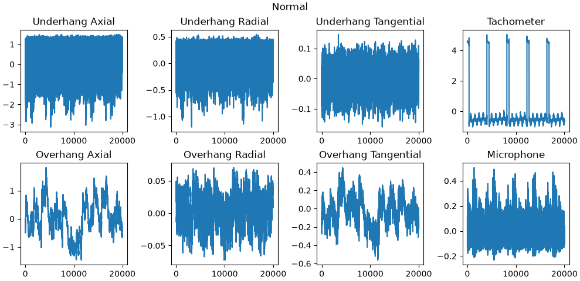

# WP2 Documentation

## Preprocessing
### Rotational speed
The tachometer measures the rotation of the shaft and creates a pulse once per rotation. The start of each pulse can be detected by the signal going from <2 to >2 between consecutive samples. By computing the time between the start of consecutive pulses rotational speed can be computed.

 

Note: Rotational speed is undefined until the first pulse is detected, and might be inaccurate until the second pulse depending on the initial phase of the signal.

## Raw Signal Visualization
The signals were plotted for one normal series and one imbalance series (25g) over 20000 samples:

We note that the imbalance signals (apart from the tachometer and microphone) exhibit larger vibration magnitudes, with a strong signal component at half the rotational frequency. We also note a slight increase of peak microphone values from 0.4 to 0.6.